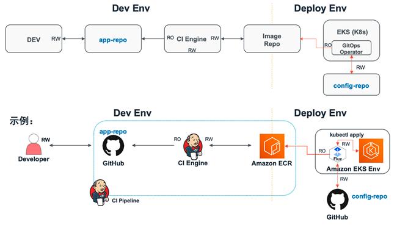
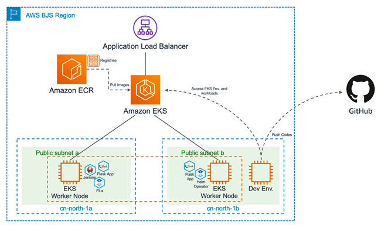

# aws-eks-cicd-workshop

## GitOps CI/CD实践

* 基础的GitOps CI/CD流水线如下图所示：



* 实验环境在AWS的部署架构如下图所示：



其中代码仓库GitHub包含两个代码库，一个为保存应用代码的app-repo，另一个为保存应用配置和部署文件的config-repo。CI/CI流水线中的持续集成引擎Jenkins和持续交付引擎Flux全部以Pod方式部署在Amazon EKS环境中。

基本的工作流程如下：

- 开发者在开发环境中编写代码，并将最终完成的应用代码推送至app-repo；
- 应用代码库app-repo中的代码变更触发Jenkins CI引擎，Jenkins按照既定的Pipeline对代码进行编译打包并生成容器镜像，然后将其推送至Amazon ECR容器镜像仓库；
- 部署在EKS环境中的CD引擎Flux周期性扫描ECR容器镜像仓库并从中拉取应用的容器镜像元数据，当发现有新版本的容器镜像产生时会自动将新版本的容器镜像地址通过git commit/push同步至保存在config-repo中的应用部署文件；
- Flux周期性拉取config-repo代码库中的应用配置和部署文件，并比较集群当前的应用负载运行状态是否和config-repo中的文件所描述的期望一致，当发现二者有差异时，Flux会自动将差异同步至EKS集群，确保工作负载始终按照期望状态运行。

app-repo代码库中的应用代码的详细结构如下：
```
app-repo
|-- app.py
|-- Dockerfile
|-- Jenkinsfile
|-- README.md
|-- requirements.txt
|-- static
|   `-- css
|       `-- mystyle.css
`-- templates
    `-- index.html
```

config-repo代码库中的应用代码的详细结构如下：
```
config-repo/
|-- namespaces
|   `-- gitops-cicd.yaml
|-- README.md
`-- workloads
    |-- gitops-example-dep.yaml
    |-- gitops-example-ingress.yaml
    `-- gitops-example-svc.yaml
```